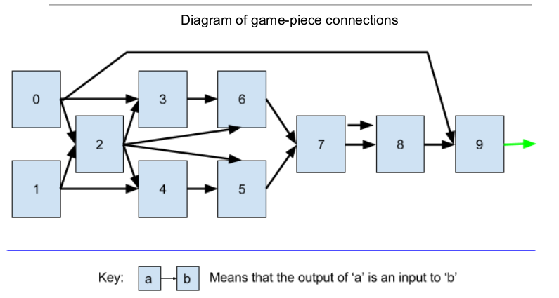

To run the program you may need to be using a Linux OS

Open a terminal and navigate to the "a.out" directory
to run the program just type ./a.out 

Coding​ ​ Challenge
The​ ​ goal​ ​ is​ ​ to​ ​ create​ ​ a ​ ​ specific​ ​ game.​ ​ There​ ​ are​ ​ 8 ​ ​ pieces​ ​ that​ ​ the​ ​ player​ ​ can​ ​ interact
with,​ ​ and​ ​ 2 ​ ​ special​ ​ pieces​ ​ which​ ​ will​ ​ be​ ​ explained​ ​ later.
The​ ​ objective​ ​ of​ ​ the​ ​ game​ ​ is​ ​ to​ ​ get​ ​ power​ ​ to​ ​ exit​ ​ the​ ​ system​ ​ on​ ​ the​ ​ right-hand​ ​ side​ ​ (
represented​ ​ by​ ​ the​ ​ green​ ​ arrow​ ​ in​ ​ the​ ​ diagram​ ​ below.)​ ​ To​ ​ accomplish​ ​ this,​ ​ players​ ​ can
configure​ ​ a ​ ​ game​ ​ piece​ ​ into​ ​ one​ ​ of​ ​ 3 ​ ​ states:
● Sink​ ​ State
○ This​ ​ state​ ​ never​ ​ emits​ ​ power​ ​ under​ ​ any​ ​ condition
● And​ ​ State
○ This​ ​ state​ ​ emits​ ​ power​ ​ if​ ​ exactly​ ​ 2 ​ ​ of​ ​ the​ ​ input​ ​ wires​ ​ have​ ​ power
● Xor​ ​ State
○ This​ ​ state​ ​ emits​ ​ power​ ​ if​ ​ exactly​ ​ 1 ​ ​ of​ ​ the​ ​ input​ ​ wires​ ​ have​ ​ power
Furthermore​ ​ there​ ​ are​ ​ 2 ​ ​ special​ ​ game​ ​ pieces​ ​ that​ ​ currently​ ​ have​ ​ fixed​ ​ states,​ ​ but​ ​ might
be​ ​ converted​ ​ into​ ​ normal​ ​ game​ ​ pieces​ ​ in​ ​ a ​ ​ future​ ​ update.
● Dummy​ ​ Block
○ Never​ ​ emits​ ​ power,​ ​ but​ ​ doesn’t​ ​ count​ ​ as​ ​ Sink​ ​ state
○ Labeled​ ​ as​ ​ block​ ​ 0 ​ ​ in​ ​ the​ ​ diagram
● Source​ ​ Block
○ Always​ ​ Emits​ ​ Power
○ Labeled​ ​ as​ ​ block​ ​ 1 ​ ​ in​ ​ the​ ​ diagram

